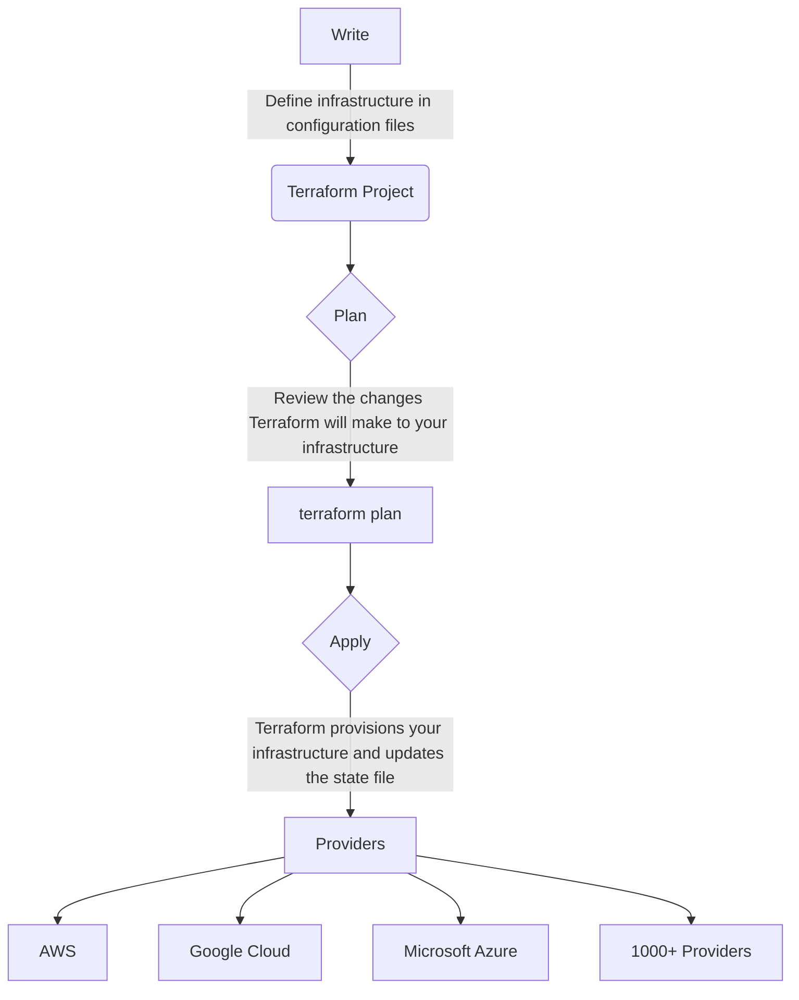
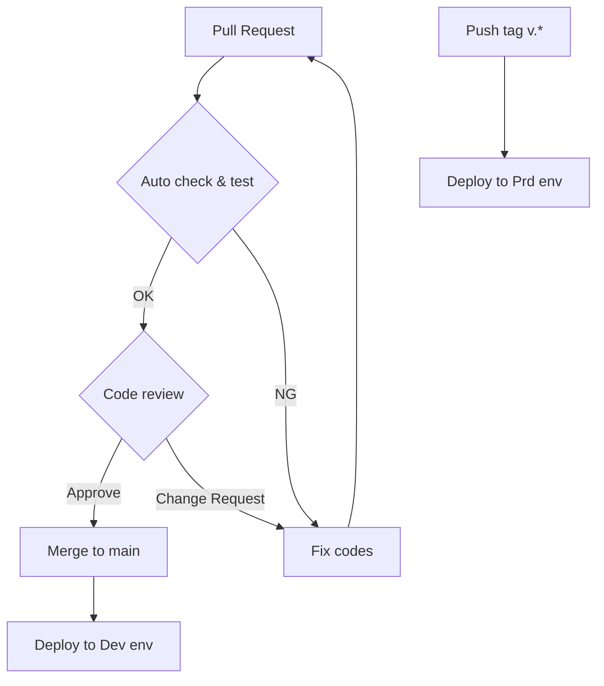

# gdg-tokyo-monthly-online-tech-talks-firebase

Firebase における IaC と CI/CD パイプライン構築のすゝめ

## IaC とは？

インフラのコード化 = Infrastructure as Code

### Firebase の IaC 化

- 複数環境のプロジェクト構築の**効率化**を行うことができる
- 複数環境のデータを**一元管理**できる
- 意図しないリソース変更を**防止**することができる

### IaC ツール

- [Terraform](https://www.terraform.io/)
- [pulumi](https://www.pulumi.com/)
- [AWS Cloud Formation](https://aws.amazon.com/jp/cloudformation/)
- [Azure ARM テンプレート](https://learn.microsoft.com/ja-jp/azure/azure-resource-manager/templates/)
- [Google Cloud Deployment Manager](https://cloud.google.com/deployment-manager/docs?hl=ja)
- など...

-> 今回は 各種クラウドプロバイダーに依存せずより一般的に使用可能な Terraform を採用。

## Terraform Workflow



### Write

インフラストラクチャをコードとして定義するステップ。
Terraform においては `.tf` ファイルに対し HCL 言語でコーディングを行う。
このファイルには、作成したいリソースの種類、そのプロパティ、およびそれらのリソース間の関連が記述される。

```hcl
# Provisions the Firestore database instance.
resource "google_firestore_database" "firestore" {
  provider         = google-beta
  project          = var.project_id
  name             = "(default)"
  location_id      = "asia-northeast1"
  type             = "FIRESTORE_NATIVE"
  concurrency_mode = "OPTIMISTIC"

  # Wait for Firebase to be enabled in the Google Cloud project before initializing Firestore.
  depends_on = [
    google_firebase_project.default,
  ]
}
```

### Plan

`terraform plan` コマンドを実行すると、Terraform は現在の状態と定義ファイルを比較して、実行する必要があるアクションを決定します。この計画段階では、どのリソースが作成、更新、削除されるかを確認できる。
変更を適用する前に意図した変更が行われることを確認するためのステップ。

<details>

<summary>1 リソースを削除する plan 例</summary>

```hcl
Terraform used the selected providers to generate the following execution
plan. Resource actions are indicated with the following symbols:
  - destroy

Terraform will perform the following actions:

  # google_firestore_document.docs["question-4"] will be destroyed
  # (because key ["question-4"] is not in for_each map)
  - resource "google_firestore_document" "docs" {
      - collection  = "quiz" -> null
      - create_time = "2024-01-11T14:25:40.933816Z" -> null
      - database    = "(default)" -> null
      - document_id = "question-4" -> null
      - fields      = jsonencode(
            {
              - answer   = {
                  - stringValue = "Answer 4"
                }
              - question = {
                  - stringValue = "Forth Question"
                }
            }
        ) -> null
      - id          = "projects/firebase-short-session-dev/databases/(default)/documents/quiz/question-4" -> null
      - name        = "projects/firebase-short-session-dev/databases/(default)/documents/quiz/question-4" -> null
      - path        = "quiz/question-4" -> null
      - project     = "firebase-short-session-dev" -> null
      - update_time = "2024-01-11T14:25:40.933816Z" -> null
    }

Plan: 0 to add, 0 to change, 1 to destroy.
```

</details>

### Apply

`terraform apply` コマンドを実行すると、`plan` ステップで作成された実行計画に従ってインフラストラクチャをプロビジョニングする。
また、その際に Terraform の `.tfstate` ファイルが更新されて実際のインフラストラクチャの状態を反映するようになる。

<details>

<summary>1 リソースを削除する apply 例</summary>

```hcl
Terraform used the selected providers to generate the following execution
plan. Resource actions are indicated with the following symbols:
  - destroy

Terraform will perform the following actions:

  # google_firestore_document.docs["question-4"] will be destroyed
  # (because key ["question-4"] is not in for_each map)
  - resource "google_firestore_document" "docs" {
      - collection  = "quiz" -> null
      - create_time = "2024-01-11T14:25:40.933816Z" -> null
      - database    = "(default)" -> null
      - document_id = "question-4" -> null
      - fields      = jsonencode(
            {
              - answer   = {
                  - stringValue = "Answer 4"
                }
              - question = {
                  - stringValue = "Forth Question"
                }
            }
        ) -> null
      - id          = "projects/firebase-short-session-dev/databases/(default)/documents/quiz/question-4" -> null
      - name        = "projects/firebase-short-session-dev/databases/(default)/documents/quiz/question-4" -> null
      - path        = "quiz/question-4" -> null
      - project     = "firebase-short-session-dev" -> null
      - update_time = "2024-01-11T14:25:40.933816Z" -> null
    }

Plan: 0 to add, 0 to change, 1 to destroy.
google_firestore_document.docs["question-4"]: Destroying... [id=projects/firebase-short-session-dev/databases/(default)/documents/quiz/question-4]
google_firestore_document.docs["question-4"]: Destruction complete after 1s


Apply complete! Resources: 0 added, 0 changed, 1 destroyed.
```

</details>

## IaC 管理対象リソース

本リポジトリで IaC 管理対象としているクラウドリソースは下記の通り。

- Firebase
  - Firebase Projects
  - Cloud Storage Resource
    - Storage Rules
  - Cloud Firestore Resource
    - Firestore Documents
    - Firestore Rules
  - Firebase Authentication
    - Anonymous

※ Google Cloud 側のリソースについては IaC 管理対象外（コンソールからの手動作成）としている。

### Firebase リソースとディレクトリの関連

```plain
.
├── firebase_rules
│   ├── firestore.rules     # Cloud Firestore のセキュリティルール
│   └── storage.rules       # Cloud Storage for Firebase のセキュリティルール
├── authentication.tf       # Firebase Authentication に関するリソース群
├── backend.tf              # .tfstate を保持する Storage バケット定義ファイル　
├── firestore.tf            # Cloud Firestore に関するリソース群
├── locals.tf               # コード内共通の定数群
├── main.tf                 # Firebase プロジェクト自体に関するリソース群
├── provider.tf             # Google プロバイダ定義ファイル
├── storage.tf              # Cloud Storage for Firebaseに関するリソース群
└── variables.tf            # 外部から注入してもらう変数群
```

## CI/CD パイプライン構築

本リポジトリでは、Firebase の dev/prod 環境に対する CI/CD を構築しています。

### Workflow




- `Pull Request` 作成時
  - CI 実行
    - Terraform フォーマットチェック
    - 実行計画
- `main` ブランチマージ時
  - 開発環境に対する CD 実行
    - Terraform 適用
- `tag` 付与時
  - 本番環境に対する CD 実行
    - Terraform 適用

### パイプライン構築方法

#### 1. Firebase プロジェクトを生成するための Google Cloud プロジェクトを作成


#### 2. 作成した Google Cloud プロジェクトを Firebase プロジェクトにするためのラベルを設定


#### 3. `.tfstate` を保持する Cloud Storage バケットを作成

このステップによって、コードを触るメンバー間での環境差分を無くします。


#### 4. Workload Identity 連携

##### 4-1. GitHub Actions が Firebase にアクセスするためのサービスアカウントを作成


##### 4-2. サービスアカウントに対し、必要なロールを付与


##### 4-3. ID プールの作成


##### 4-4. プールにプロバイダを追加


##### 4-5. プロバイダの属性を構成


##### 4-6. サービスアカウントに対してアクセス権を付与


#### 5. GitHub Actions Workflows の定義

本リポジトリでは下記環境変数を dev/prod 環境用それぞれ定義している。
| NAME | VALUE |
| --- | --- |
| WORKLOAD_IDENTITY_PROVIDER | `projects/<プロジェクト番号>/locations/global/workloadIdentityPools/<Workload Identity プール ID>/providers/<Workload Identity プロバイダ ID>` |
| SERVICE_ACCOUNT_MAIL | `github-actions-terraform@<プロジェクトID>.gserviceaccount.com` |
| BUCKET_NAME | `<バケット名>` |
| PROJECT_ID | `<プロジェクトID>` |
| BILLING_ACCOUNT | `<GCP請求先アカウントID>` |

##### 5-1. CI

[plan_dev.yaml](/.github/workflows/plan_dev.yaml)

##### 5-2. CD for dev

[apply_dev.yaml](/.github/workflows/apply_dev.yaml)

##### 5-3. CD for prod

[apply_prod.yaml](/.github/workflows/apply_prod.yaml)

## 登壇スライド

[Firebase における IaC と CI/CD パイプライン構築のすゝめ](https://docs.google.com/presentation/d/1WEzqYFUw5ieKC15f2iUBgdq3X5mYh-EHRfwD05GHioM/edit?usp=sharing)
